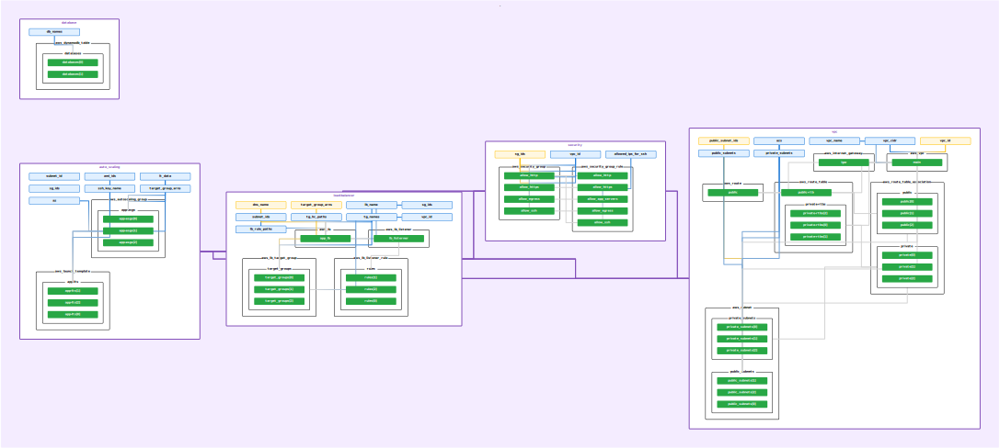

# Terraform Infrastructure as Code (IaC)

This project contains Terraform configuration files for provisioning and managing a scalable and secure infrastructure on AWS. The infrastructure setup includes the creation of a Virtual Private Cloud (VPC), security configurations, databases, load balancers, and auto-scaling for EC2 microservices. 



## Requirements
- [AWS Account](https://portal.aws.amazon.com/billing/signup)
- [AWS CLI](https://docs.aws.amazon.com/cli/latest/userguide/getting-started-install.html)
- [Terraform CLI](https://developer.hashicorp.com/terraform/tutorials/aws-get-started/install-cli)
- [App/Microservice AMIs](https://docs.aws.amazon.com/AWSEC2/latest/UserGuide/AMIs.html)


## Installation

Clone the repo:
```
git clone https://github.com/footedroom575/ce-terraform-project.git
```

Inside repo, run below set of commands in order:

```
terraform init
```

After changing `terraform.tfvars` and [authenticating your aws credentials](https://docs.aws.amazon.com/cli/latest/userguide/cli-chap-authentication.html), run:
```
terraform apply
```


## Modules

### VPC
The VPC module `(./modules/vpc)` creates a Virtual Private Cloud with specified parameters such as VPC name, CIDR block, public and private subnets, and availability zones. This VPC contains all resources that are going to be created inside this project.

```
module "vpc" {
  source          = "./modules/vpc"

  # name of vpc
  vpc_name        = var.vpc_name

  # CIDR range of VPC. The subnet CIDRs are dependant on this value.
  vpc_cidr        = var.vpc_cidr

  # CIDR ranges of public subnets created inside VPC
  public_subnets  = var.public_subnets

  # CIDR ranges of private subnets created inside VPC
  private_subnets = var.private_subnets

  # List of Availability Zones for public & private subnets
  azs             = var.azs
}
```

### Security
The Security module `(./modules/security)` configures security settings, including the VPC ID and allowed IP addresses for SSH access. It allows for ingress HTTP, HTTPS, SSH and application server port and egress all protocols and ports.

```
module "security" {
  source              = "./modules/security"

  # ID of the VPC to create security groups in.
  vpc_id              = module.vpc.vpc_id

  # IPs to whitelist for SSH access. Using 32 bit CIDR is recommended.
  allowed_ips_for_ssh = var.allowed_ips_for_ssh
}
```

### Databases
The Database module `(./modules/databases)` sets up [DynamoDB](https://docs.aws.amazon.com/amazondynamodb/latest/developerguide/Introduction.html) tables with specified names. If you don't need one, pass an empty object or comment this module block.

```
module "database" {
  source  = "./modules/databases"

  # List of names of databases to create for microservices
  db_names = var.db_names
}
```

### Load Balancer
The Load Balancer module `(./modules/load-balancer)` configures a load balancer with associated parameters like VPC ID, security group IDs, subnet IDs, target group names, health check paths, load balancer name, and rule paths. Its an [Application Load Balancer (ALB)](https://docs.aws.amazon.com/elasticloadbalancing/latest/application/introduction.html) that uses [path-based routing](https://aws.amazon.com/blogs/containers/using-aws-application-load-balancer-path-based-routing-to-combine-amazon-ecs-launch-types/).

```
module "load-balancer" {
  source        = "./modules/load-balancer"

  # ID of the VPC to create load balancer in.
  vpc_id        = module.vpc.vpc_id

  # Name of the Application Load Balancer (ALB)
  lb_name       = var.lb_name

  # IDs of security groups to link with Application Load Balancer (ALB)
  sg_ids        = module.security.sg_ids

  # IDs of subnets to create the ALB in.
  subnet_ids    = module.vpc.public_subnet_ids

  # Names of target groups to be linked with Application Load Balancer (ALB)
  tg_names      = var.tg_names

  # List of paths used for ALB target group health check i.e. url path of health check endpoint that can be used to identify health/state of application
  tg_hc_paths   = var.tg_hc_paths

  # List of paths used for ALB listeners to forward the requests
  lb_rule_paths = var.lb_rule_paths
}
```

### Auto Scaling
The Auto Scaling module `(./modules/auto_scaling)` automates the scaling of instances based on specified parameters such as availability zone, SSH key name, launch template names, minimum and maximum instance sizes, desired capacity, subnet ID, security group IDs, AMI IDs, and target group ARNs. Read more about auto scaling [here](https://aws.amazon.com/autoscaling/). 

```
module "auto_scaling" {
  source = "./modules/auto_scaling"

  # Availability Zone to deploy the Auto-Scaling group in
  az                = var.azs[0]

  # SSH key name (as stored in AWS)
  ssh_key_name      = var.key_name

  # Details for auto scaling by each service such as name, desired_capacity, max_size & min_size
  lt_data           = var.lt_data

  # ID of aws_subnet for configuring the Network Interface of each launch template
  subnet_id         = module.vpc.public_subnet_ids[0]

  # Security Group IDs to be linked with each launch template
  sg_ids            = module.security.sg_ids

  # Amazon Machine Image (AMI) ids to for creating launch template
  ami_ids           = var.amis

  # Target groups ARNs linked with Application Load Balancer for auto-scaling integeration
  target_group_arns = module.load-balancer.target_group_arns
}
```

### Note

Currently, the microservices setup using the `app_servers` module is commented out as target groups are now auto-scaled. Also, current setup only utlises first availability zone, you can change that as per your requirements in `modules/[module_name]/main.tf`.